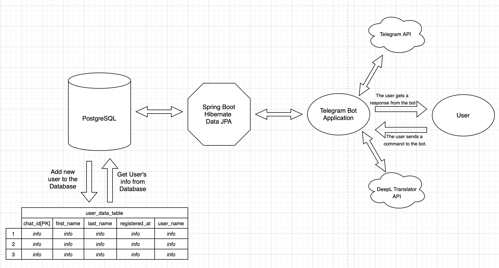

# 🤖 DeepL Translator Telegram Bot 🤖


DeepL Translator Telegram Bot created by [@Doberman786](https://github.com/Doberman786).

## Idea
The main idea of the project, to create a Telegram bot for easy and fast translation of text into different languages.

## MVP Scope
For me as a user, I don't want to have to open a separate app or website every time I want to translate something 
I've read in Telegram in order to do that. I want to do it without leaving the app.

# How it works
The Telegram user starts the bot by entering the `/start` command. After this command, the user will be saved to the
database. Further communication with the bot occurs by means of commands, which can be seen by writing bot `/help`.



# Getting Started
## Necessary parameters for running the bot
### Generate Telegram API Token
To generate your own telegram token, you can use the [BotFather](https://t.me/botfather) and generate the bot's name and token.
Otherwise, follow [this instruction](https://core.telegram.org/bots/tutorial).

### Generate DeepL API Token
To generate a token, follow this [link](https://www.deepl.com/pro-api?cta=header-pro-api/)

### Insert tokens into the code
You need to put the tokens into the code by following these steps:

- Replace `bot.token` [In this properties file](src/main/resources/application.properties) with your own token.
``` properties
# Put your BOT_TOKEN here
bot.token=YOUR_BOT_TOKEN
```
- Replace `bot.name` [as well](src/main/resources/application.properties).
``` properties
# Put your BOT_NAME here
bot.name=YOUR_BOT_NAME
```
- Replace `authKey` [here](src/main/java/com/telegrambot/deepl/service/TranslateMessageService.java)
``` java
private static final String authKey = YOUR_AUTH_KEY // Put your AUTH_KEY here
```
- Do the same steps for [Dockerfile](Dockerfile) and [docker-compose.yml](docker-compose.yml) if you want to use a Docker.

If you want to use your personal database, you will also need to change the appropriate fields in all of the above files.

# Development
For development use `docker-compose.yml` file. Required software:
 - docker
 - docker-compose

You should run command:
```
docker-compose up
```

# Technology Stack
- Maven - Project build system.
- Spring Boot - As a skeleton framework 
- Hibernate - Communication with the database.
- PostgreSQL - Database for storing registered users.
- Telegram API - Telegram API to interact directly with the bot. Access to all functions of the bot.
- DeepL API - The DeepL translator API for implementing the translation function on a third-party service.

## License
This project is Apache License 2.0 - see the [LICENSE](LICENSE) file for details
